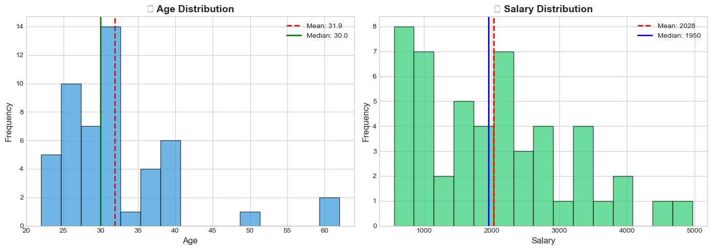

# 📊 Descriptive Statistics Case Study on Employee Dataset

**Author:** Piyush Ramteke

---

## 📝 Overview

A comprehensive case study analyzing an **Employee Dataset** using descriptive statistics. This project demonstrates how to uncover patterns, distributions, and insights about workforce characteristics using Python.

---

## 🎯 What You'll Learn

- Load and clean data using Python & Pandas
- Calculate **Central Tendency** (Mean, Median, Mode)
- Calculate **Dispersion Measures** (Min, Max, Standard Deviation, Variance)
- Compare statistics across different groups
- Visualize data distributions with charts

---

## 📂 Dataset

**50 employees** with the following attributes:

| Column | Description |
|--------|-------------|
| `Employee_ID` | Unique identifier |
| `Blood_Group` | A, B, AB, or O |
| `Age` | Age in years (22-62) |
| `Healthy_Eating_Score` | Self-reported score (1-9) |
| `Active_Lifestyle_Score` | Activity level score (1-10) |
| `Salary` | Annual salary |

---

## 🛠️ Tech Stack

- **Python 3.8+**
- **Pandas** - Data manipulation
- **NumPy** - Numerical operations
- **Matplotlib & Seaborn** - Visualization
- **SciPy** - Statistical functions

---

## 🚀 How to Run

```bash
# Clone the repository
git clone https://github.com/Piyu242005/Descriptive-Statistics-Case-Study-on-Employee-Dataset.git

# Navigate to folder
cd Descriptive-Statistics-Case-Study-on-Employee-Dataset

# Install dependencies
pip install pandas numpy matplotlib seaborn scipy

# Open the notebook
jupyter notebook Descriptive_Statistics_Case_Study.ipynb
```

---

## 📈 Key Findings

### Age Analysis
- **Mean:** 31.88 years | **Median:** 30 years | **Range:** 22-62 years

### Salary Analysis
- **Mean:** ₹2,027 | **Median:** ₹1,950 | **Range:** ₹556-₹4,969

### Health Scores
- **Healthy Eating:** Average 4.92/10
- **Active Lifestyle:** Average 5.90/10

---

## 📊 Screenshots

### Analysis Overview


### Output Summary


### Bar Chart - Blood Group Distribution


### Pie Chart - Employee Distribution


### Box Plot - Salary Distribution


---

## 📌 Conclusion

- Workforce is relatively young (avg ~32 years)
- High salary variation indicates diverse roles/experience
- Health scores suggest room for wellness programs
- Clean dataset with no missing values

---

## 📁 Project Structure

```
├── Descriptive_Statistics_Case_Study.ipynb  # Main analysis notebook
├── Employee Dataset.csv                      # Raw data
├── ScreenShot/                               # Visualization screenshots
│   ├── output.png
│   ├── bar chart.png
│   ├── pie chart.png
│   └── boxplot.png
└── README.md                                 # This file
```

---

⭐ **Star this repo if you found it helpful!**
